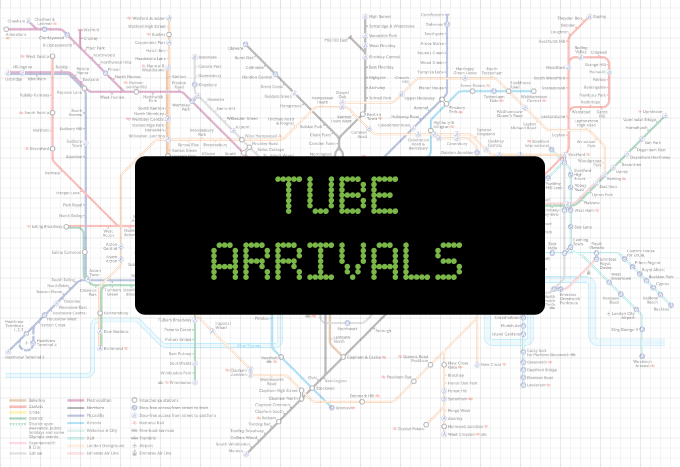

# Tube-Arrivals  
  
Tube Arrivals is a responsive minimalist application that does one concise thing : displays train arrivals for tube stations on the famous London Underground.

## Pre-requisites
* An installation of Python
## Setting up and running application
After you’ve downloaded the source code it’s worth [creating a virtual environment](https://uoa-eresearch.github.io/eresearch-cookbook/recipe/2014/11/26/python-virtual-env/) to keep a separation between python libraries you may have installed locally and the ones used by this application.  
Once virtual environment is activated from the command line run:  
* pip install flask
* pip install -U arrow
   
To start the application:  
* python main.py

# Technical Details
Python web application using:
* Flask
* Bootstrap 4
* Transport for London Unified API
* Google Fonts

# Requirements

## User Story
**As a** passenger  
**I want** to know when the next trains are arriving at my local station  
**So that** I can work out when I need to leave my location in order to get the train I need and become aware of any issues

## Acceptance Criteria
**GIVEN**  
A passenger wants to know train arrivals for a local station  
**WHEN**  
They search for arrival information  
**THEN**  
They must specify the station name they are interested in  

**GIVEN**  
A station is submitted for viewing it's arrivals information  
**WHEN**  
Arrivals information is retrieved  
**THEN**  
The following information is displayed:
- Platform number
- Train sequence (e.g. 1,2,3)
- Destination station
- When due (in minutes)
- Expected arrival time
- Current location of train

**GIVEN**  
There is no arrivals information available for a station  
**WHEN**  
Arrivals information is retrieved  
**THEN**  
A  message is displayed informing no arrivals information is available and line status is displayed  

# Design  
## User Interface  
### Responsive  
* The application must render properly across various device types  
### Look and Feel
* The site will have a background image which invokes a feeling of familiarity for tube users  
* The arrivals presentation is inspired by the digital display boards found Lt tube stations  
* Font to replicate dot matrix display is Codystar 
* Font to display the station name and line status is the elegant Julius Sans One  
* Lines will be represented by their familar TfL  colours (e.g. the central line is red, circle line is yellow)  
* Line status will be represented by the familar Red-Amber-Green scheme  (Red = severe  delays, Amber = minor  delays, Green = good service)  

## DATA - Sourced from the TfL Unified API
### Real Time Live  
* Arrivals for a specific station on a specific line  
  * Line/line_id/Arrivals/station_id  
  * (e.g. arrivals at Liverpool Street on the Circle line) : https://api.tfl.gov.uk/Line/circle/Arrivals/940GZZLULVT  
  * The arrivals view needs to refresh every 60 seconds  
* Status of a specific line  
  * Line/line_id/Status?detail=true  
  * (e.g. current status (good service, minor delays etc) of the circle line) : https://api.tfl.gov.uk/Line/circle/Status?detail=true  
* Distruption information for a specific line  
  * Line/line_id/Disruption  
  * (e.g. service can be distrupted for various reasons (engineering works etc) : https://api.tfl.gov.uk/Line/circle/Disruption  
### Static data   
_The list of stations made available on the station search view must be generated once and stored locally to act as the source data for the search input field. Calling the API each time the page loads for list of valid stations is time consuming and wasteful._  

* Stations on a specific line  
  * Line/line_id/StopPoints  
  * (e.g. get the list of stations on the circle line) : https://api.tfl.gov.uk/Line/circle/StopPoints
  * This webservice is invoked once for each line to build up the total list of stations on the tube network. The station list is generated as a one-off activity and once generated is stored as a local json file. 
  
## Code
In keeping with the minimalist approach for UI and features I extended the same thought towards number of project files and intentionally wrapped javascript into the html files.  

# API Analysis 
The API responses are verbose and required careful analysis to extract the specific elements relevant to the requirements.  
Some things learnt:  
- The API does not return arrivals data in time order - the application has responsibility to sort the data according to time
requirements
- The list of arrivals can be very long - the application has responsibility for displaying the next 10 arrivals only
- Arrivals data is not split by platform - the application has responsibility for splitting arrivals  information by platform
- The API does not always return arrivals data for a station even if there is a good service, for example Becontree never
seems to have live arrivals information! There needs to be a check for empty responses to deal with it elegantly and not with a
crash!

# Wireframes
See file "Tube_Arrivals_Specification.pdf"
